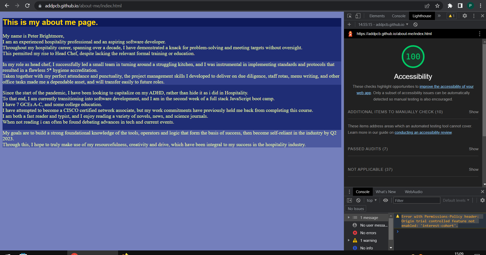
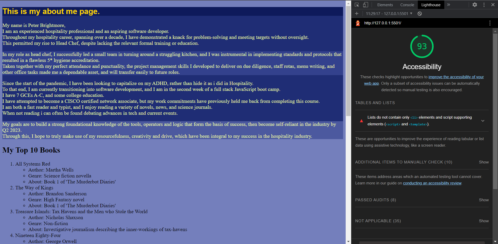

# about me

- Created an About Me guessing game using HTML, CSS, and JavaScript.

- Added a short biography, education history, job experience, and goals to the HTML page.

- Prompted the user a total of 5 yes or no questions and validated the user input to make sure it is case sensitive.

- Added alert messages to notify the user if they answered the question correctly.

- Asked the user their name through a prompt().

- Displayed the user's name back to them through a custom greeting and in a final message.

- Added lighthouse accessibility score for completed lab02 about page:

- Added second lighthouse accessibility score for completed lab03:

